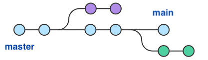

Renaming github branchs
=====

## Simple approach

```
$ git branch -m master main
$ git push -u origin main
```

## 2nd try

```bash
# Step 1 
# create main branch locally, taking the history from master
git branch -m master main

# Step 2 
# push the new local main branch to the remote repo (GitHub) 
git push -u origin main

# Step 3
# switch the current HEAD to the main branch
git symbolic-ref refs/remotes/origin/HEAD refs/remotes/origin/main

# Step 4
# change the default branch on GitHub to main
# https://docs.github.com/en/github/administering-a-repository/setting-the-default-branch

# Step 5
# delete the master branch on the remote
git push origin --delete master
```

## To check if it is working

```bash
git branch -a
```


